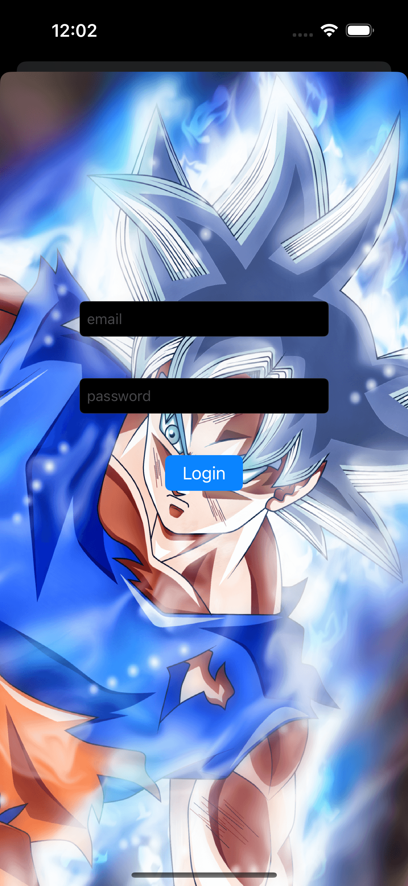
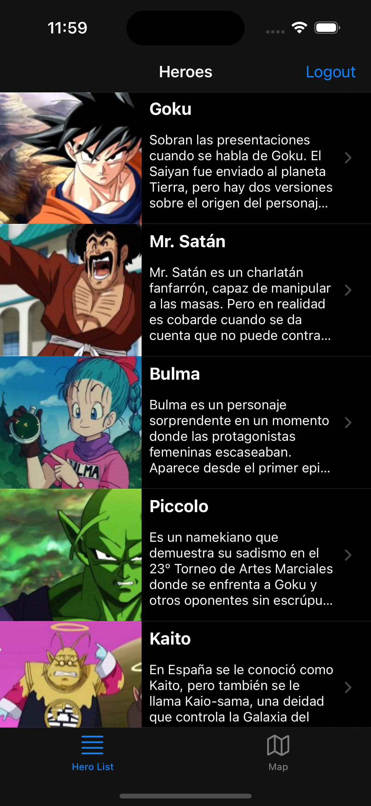
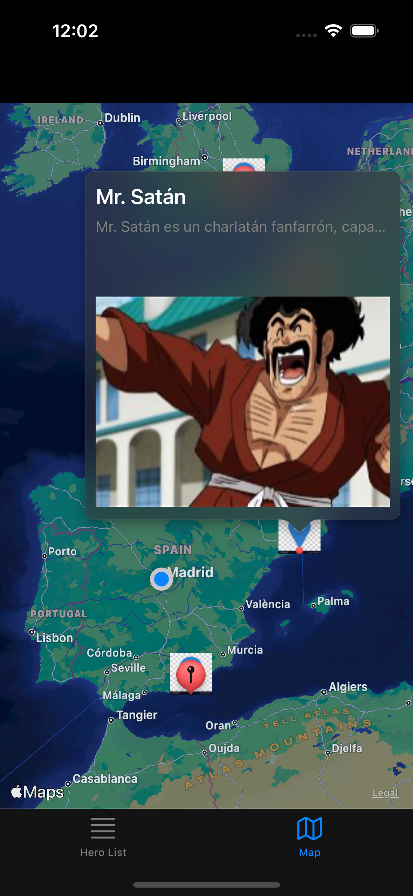
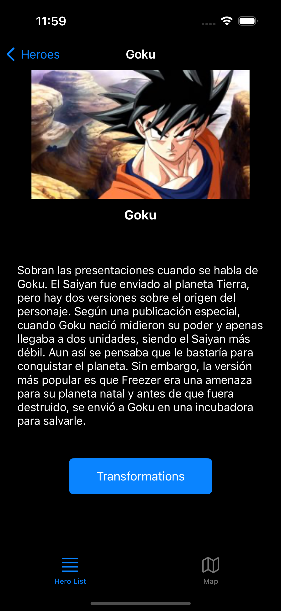
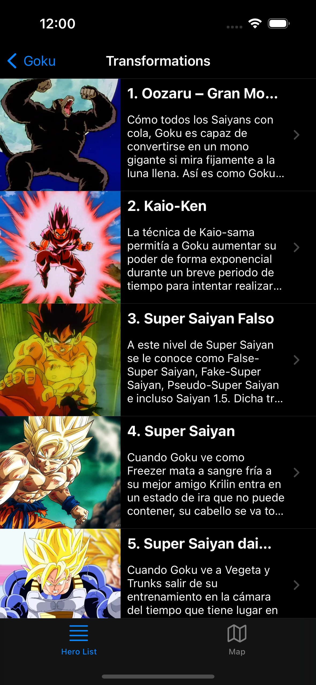
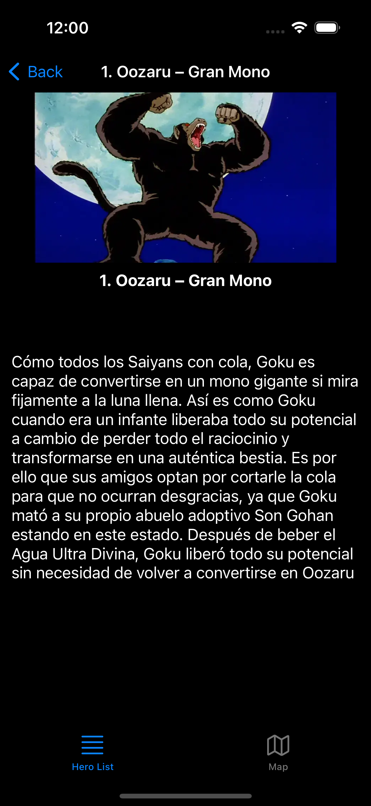

# Advanced iOS Project

## Introduction

A bootcamp project using Swift, UIKit, MVVM architecture, CoreData, NotificationCenter, login, Keychain, map functionality, RESTful API integration, testing, and SOLID/clean principles.

## Features

The application presents a set of heroes with a table, map, and detailed views. After user logs in, the app fetches API data and then saves it locally into CoreData. The application containes a:
* **Login Screen**. A login screen for the user to authenticate with username and password, to be stored in Keychain. 
* **Hero List Screen**. A list of heroes, displaying the hero name, photo, and brief description in a tableView cell.
* **Map Screen**. An Apple Maps view, displaying the heroes geographically, with location pins and photos.
* **Hero Details Screen**. A detailed view, showing the hero name, larger photo, description, and transformation button if transformations exist. 
* **Hero Transformation Screen**. A table view of applicable hero transformation, each row showing the transformation name, photo, and description.
* **Hero Transformation Details Screen**. A detailed transformation view, showing the transformation name, larger photo, and description. 

## Screenshots

| Login Screen | Hero List Screen | Map Screen |
| ------------ | ---------------- | ---------- |
|  |  |  |

| Hero Detail Screen | Transformations Screen | Transformation Details Screen |
| ------------------ | ---------------------- | ----------------------------- |
|  |  |  |
